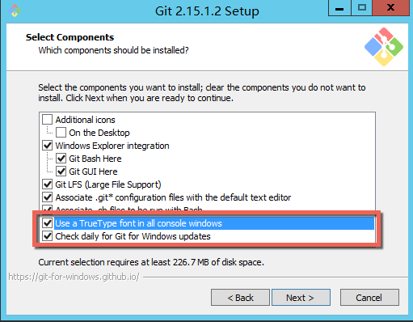
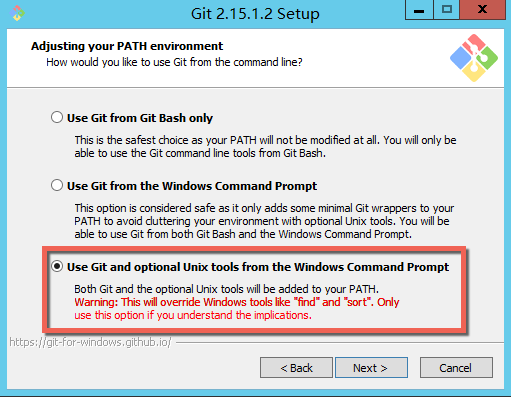
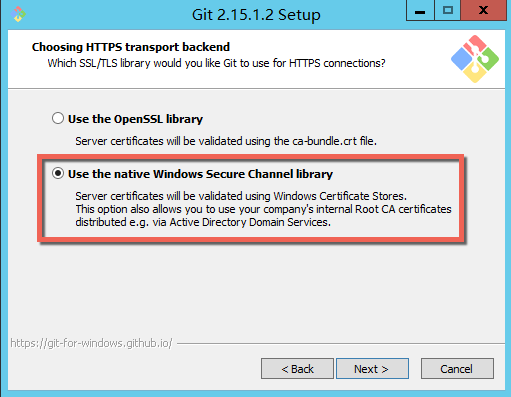
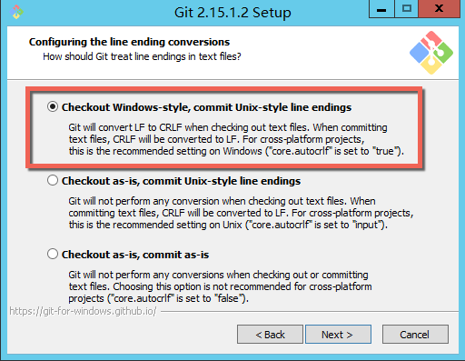
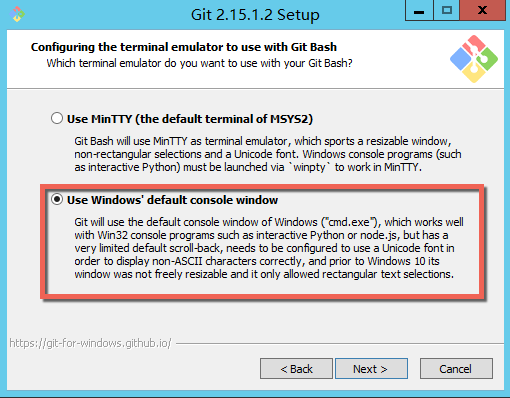

# 基础篇#3 Git安装与配置 

现在你已经对Git有了最基本的了解，现在让我们开始动手开始安装和配置Git环境。 

 

Git工具包括Git命令行工具，图形化工具和服务器环境；在我们这个教程中，我们会使用以下软件配置我们的环境： 

 

-   Windows 操作系统（推荐使用Windows 10） 

-   Git for Windows （2.15或者以上版本） 

-   Visual Studio 2017 社区免费版 

-   Visual Studio Code  

-   Cmder (Windows上最好用的命令行工具） 

-   Visual Studio Team Services 或者 Team Foundation Server 2018 以上版本 

 

## Git for Windows 安装 

 

这个安装过有几个地方大家注意修改一下默认配置，这样可以让后面的操作体验更加流畅。 

 

 

*上图中最后2个要选中，TrueType字体让命令行中的文字更加清晰，每天检查更新保证你可以一直运行Git的最新版本，Git的版本更新还是比较频繁的，之前我们在很多项目中也发现由于某一版本的缺陷造成问题，所以跟随最新版本是解决这些问题最简单的办法 *

 

 

*虽然这个选项有警告，但是我一般都会这样选择，因为现在经常需要对Linux环境进行操作，可以在Windows命令行中直接使用这些命令会很方便。 *

 

 

*选择使用 native Windows Secure Channel
library可以和企业环境更好的集成，便于和企业域中的证书认证方式一起工作。 *

 

 

*这个设置一定要保持默认选择，因为我们使用的是Windows操作系统，默认使用CRLF换行标识，但是Git默认使用LF换行标识，允许Git在提交文件时自动完成CRLF-\>LF的转换可以确保提交到GitHub/VSTS/TFS的远程Git库里面的文件可以被正确的识别。你的同事可能使用了Mac/Linux操作系统，这也确保我们可以使用Windows和他们进行更好的协作。 *

 

*具体可以参考这篇文章：https://www.tuicool.com/articles/IJjQVb *

 

 

*使用默认的Windows命令行作为Git的命令窗口，这一配置和下面的Git Credential
Manager也有很大的关系，如果不这样配置，我们可能无法正常的输入VSTS/TFS
的账户信息。 *

 

 

*最后一定要选择启用Git Credential
Manger这个选项，我们在操作远程Git服务器时经常需要输入用户名和密码，选择这个以后我们可以将身份信息使用Windows凭据管理器进行存储，不必每次都输入了。 *

 

按照以上配置完成安装以后，我们就可以对Git进行一些基本配置了。 

 

1.  设置你的名字和邮件地址：Git要求在提交时提供名字和邮件地址，这两个信息不做设置时无法执行git
    commit 动作。 

 

git config user.name "你的名字" 

git config user.email "你的邮件地址" 

 

*注：如果你使用的是企业提供的TFS服务器，请将以上信息与企业AD域中的邮件地址统一，因为这些信息会随着你的提交进入TFS服务器的Git历史记录，保持这些信息一致有助于其他开发人员通过历史记录了解你的提交记录。 *

 

1.  如果你使用TFS作为Git服务器，那么还需要另外执行以下3个命令以便Git Credential
    Manager 可以正常工作 

 

git config --global credential.helper manager 

git config --global credential.modalprompt true 

git config --global credential.{你的TFS服务器地址}.authority Basic 

 

*注：如果你需要了解以上配置到底做了什么，可以参考：FAQ \#1  *

 

配置好 Git for Windows
环境以后，其他的图形化Git工具和IDE都会直接使用以上配置，给予你在任何开发环境中一致的Git使用体验。 

 

为了能够让习惯于使用图形化工具的开发者满意，以下我介绍几款比较好用的工具，供大家参考。 

 

TortoiseGit 

 

 

这是和大家熟悉的TortoiseSVN一脉相承的一款图形化Git工具，也就是大家常说的“小乌龟”。应该说，小乌龟是最贴近于Windows使用习惯的一款git工具，因为它提供了非常完善的文件管理器集成，允许你直接通过文件管理器完成绝大多数git操作，非常直观，对于不习惯使用命令行的开发人员来说非常方便。 

 

安装完成后，直接在任何文件夹中点击右键，即可开始进行Git操作。 

 

 

 

免费下载地址，建议同时下载中文语言包： 

 

<https://tortoisegit.org/download/> 

 

 

## Visual Studio  

 

Visual Studio 内置了Git支持，并提供了针对 Visual Studio Team Service 和 Team
Foundation Server 的完善集成，另外Visual
Studio还是最好的差异比较和冲突解决工具，这一点在后续的操作中大家就会有所体会。 

 

可以通过以下链接下载 Visual Studio 社区免费版，现在的Visual Studio
2017版本已经是全模块化安装方式，最小安装仅有仅几百兆左右。与大家对Visual
Studio的传统理解不同，现在的Visual
Studio除了提供微软技术栈的SDK支持还提供了大量开源技术栈的工具支持，比如：Python,
NodeJS, JavaScript和TypeScript等。 

 

 

另外，除了对Windows上的软件提供完善的支持，也提供了跨平台的开发能力，比如：.Net
Core, Linux C++等。 

 

 

安装完成后，我们即可通过“团队资源管理器”连接到VSTS，TFS或者GitHub克隆代码，开始日常Git操作。 

 

 

历史视图 

 

比较视图 

 

免费下载地址： 

 

<https://www.visualstudio.com/zh-hans/> 

 

## Visual Studio Code  

 

Visual Studio Code
是一款轻量级的代码编辑器，同时具备很强的调试能力。这款工具由《设计模式》一书的作者，也是Eclipse之父
Eric Gamma 亲自操刀开发，是你可以找到的速度最快的，功能最丰富的代码编辑器。 

 

vscode中通过插件的方式提供了大量的git工具，包括：git blame, git history,
diff等非常实用强大的工具帮助你解决很多日常使用难题。 

 

 

下载地址： 

 

<https://code.visualstudio.com/> 

 

 

## Git企业级私有服务器环境获取 

 

GitHub对于开源软件的开发非常有帮助，但是对于企业开发者来说 Visual Studio Team
Service 或者 Team foundation Server
则提供了更为丰富的适合于大规模团队的功能。VSTS
是托管在微软云上的企业级开发平台，内置了非常完善的Git服务器支持。与GitHub不同的是，VSTS提供的是免费私有的企业级Git仓库，而在GitHub上的仓库默认都是公开的而对私有仓库收取费用。 

 

VSTS提供5人以下团队的免费账号，不限制项目和Git私有存储库数量以及大小，可以通过以下地址注册。 

 

<https://www.visualstudio.com/zh-hans/team-services/> 

 

注册过程也很简单，只需要3步，对于中国开发者来说，2017年10月份上线的香港节点提供了更好的访问速度，大家在注册的时候注意选择区域（默认区域为美国）。 

 

第一步：点击 免费试用 

 

第二步：使用你的Live账号登陆，如果没有可以免费注册 

 

第三步：输入你自己的账号别名，并注意选择 East Asia （中国香港）节点 

 

*注册完成后，我们即可通过 VSTS
示例项目生成器自动创建项目并导入示例代码，同时也会创建工作项，看板，迭代计划，测试计划，自动化构建等内容。 *

 

第一步：登录https://vstsdemogenerator.azurewebsites.net/
并输入你在上面注册的VSTS账号，如果需要更为详细的指导，请扫描以下二维码 

 

第二步：选择示例项目套件，在我们这套教程中使用PartsUnlimited示例代码 

 

第三步：项目创建成功后即可进入自己的VSTS账号进行操作了，具体操作指导请扫描以下图中二维码 

 

 

 

*如果大家对VSTS或者TFS本身的其他功能感兴趣，请参考 DevOps 文档中心 的 微软研发云
部分的文档。 *

 

## Windows命令行替代品Cmder  

 

最后为了能够在Windows上更好的使用命令行，你还需要安装一个叫做Cmder的小工具。这是Windows上最好用的命令行工具，没有之一。以下简单列出它的优势 

 

-   直接使用剪贴板，用Ctrl+V/C完成拷贝粘贴 

-   直接使用鼠标进行内容选择进行拷贝 

-   允许混用Windows和Linux风格的路径 

-   多窗口模式 

-   git分支显示 

-   内置常用的linux命令，并允许你在Windows上使用，比如（cp, mv, cat,
    rm，ssh等） 

-   内置linux上常用的文本编辑器，如：nano和wim 

-   直接适配多种屏幕分辨率，可以自由拖拽到任何大小 

-   颜色显示 

 

 

使用git不能避免命令行，有一款好用的命令行工具会让你事半功倍，下载地址如下，这是个绿色软件，直接解压缩即可使用。 

 

<http://cmder.net/>* *

 

 

## 小结 

 

到这里，我们已经做好了开始使用Git的一切准备，在下一章中我们将开始使用Git实际进行开发工作。 

 
