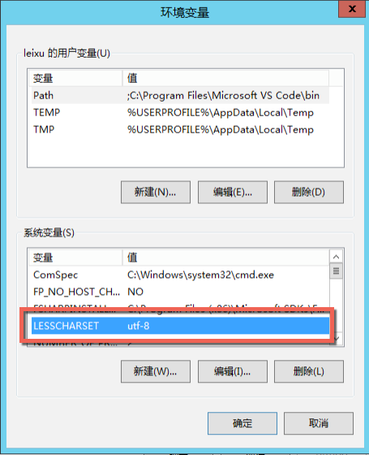
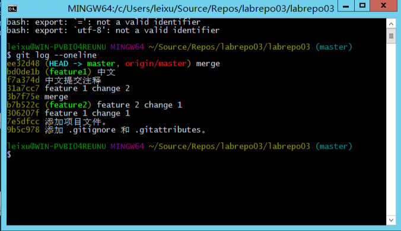
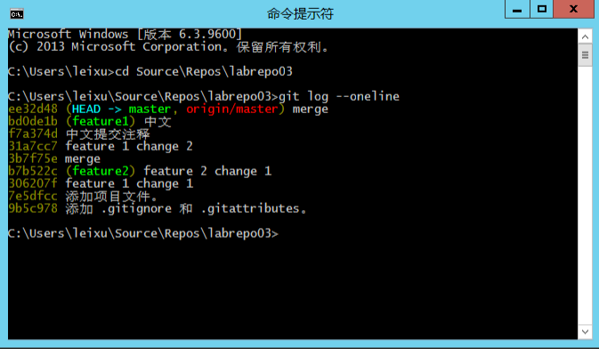
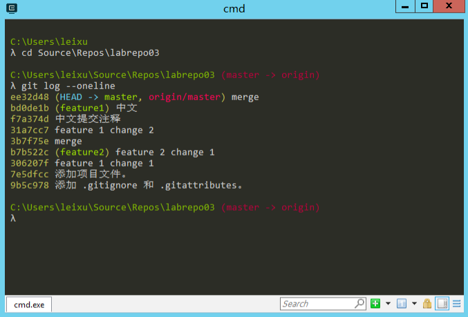
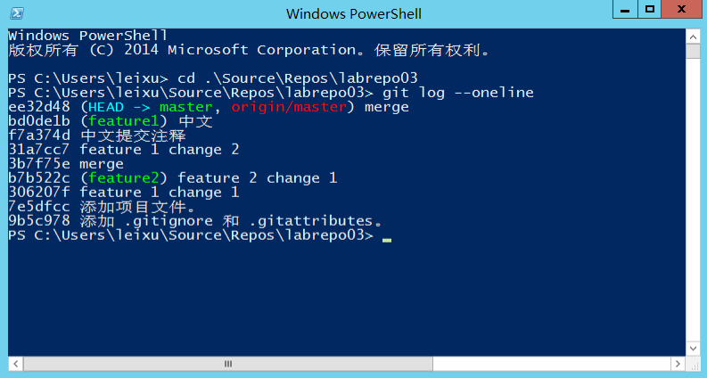

# 解决Git在Windows上的中文乱码问题

在Windows上使用Git的时候经常会遇到乱码问题，主要可能出现的工具包括 Git Bash,
Cmd窗口，PowerShell窗口，Git GUI图形界面；如果设置不正确也会影响 Visual Studio,
Visual Studio
Code，Eclipse等IDE里面的log显示。出现乱码的场景包括：中文路径（包括文件名），中文的提交注释（包括在以上工具中的显示）。 

 

乱码表现形式： 

 

路径和中文文件名，执行 git status 看到如下结果 

 

 

使用git log时出现如下结果 

 

 

造成乱码的原因如下 

 

1.  Windows默认使用GB2312来处理文件名和内容，但Git默认使用UTF-8 

2.  Git命令在输出log的时候会使用less这个工具，默认和Windows的编码格式不兼容 

3.  不同的命令行工具（终端）对环境变量的处理方式不同 

 

解决办法：在所有地方统一使用utf-8编码，避免所有编码乱码问题。 

 

 

##修改 Gitconfig 

 

可以直接修改本机的system级别也可以针对当前用户修改global级别，区别在于system的修改无论谁使用这台机器都生效，global级别进针对当前用户生效。企业环境中建议通过使用system级别，特别是服务器环境上可能会有多人同时登陆，避免出现问题。 

 

*注意：以下命令可以直接执行，如果要把--global替换成--system则需要在执行时提升命令行窗口权限（右键-\>使用管理员运行）的方式执行。 *

 

\$ git config --global core.quotepath false          \# 解决 git status
中文件路径的编码问题 

\$ git config --global gui.encoding utf-8            \# 图形Git GUI界面编码 

\$ git config --global i18n.commit.encoding utf-8    \# 提交信息编码 

\$ git config --global i18n.logoutputencoding utf-8  \# 输出 log 编码 

 

注：如果需要了解更多关于gitconfig的信息，请参考：常见问题\#2 

 

##修改环境变量 

 

因为 Git for
Windows可能通过不同的命令行工具执行，所以我们需要针对不同的环境分别设置环境变量，当然，如果你只使用其中一种，只设置一个也可以。 

 

1.针对 Git Bash 的环境变量，修改 C:\\Program Files\\Git\\etc\\profile  

 

export LESSCHARSET=utf-8 

 

*注意：修改这个文件也需要提升权限才可以。 *

 

2.针对Windows的其他命令行工具，如：Powershell, cmd和cmder 

 

 

##修复后的效果 

 

Git Bash 

Cmd 

cmder 

Powershell 

